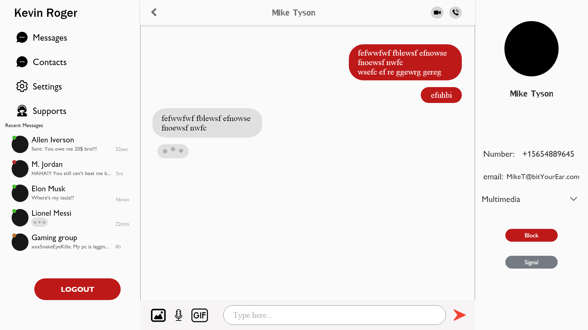
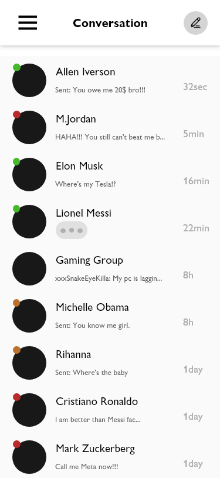
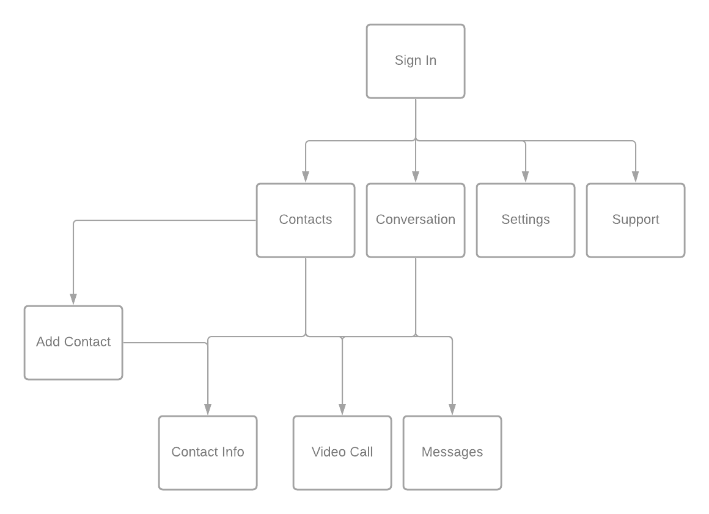

# Slicky
## Date: 02/07/2021
### By: **Mohamed Kone**

#### [GitHub](https://Github.com/Mohamedkone)|[Website](https://www.Mohamedkone.com)

***

### ***Description***
#### Slicky is a cross-platform mobile application that provides an end-to-end encrypted instant messaging system via both mobile phone networks and the Internet

***

### ***Technology Used***
* MERN
* Firebase
  * firebase database
* WebRTC
* Python

### ***Getting Started***

##### Sign up and sign in as a new user and gain acces to the SLicky app which will allow you to connect with you friend all around the world in a peer to per way
##### A Trello board was used to keep track of development progress and can be viewed [here](https://trello.com/b/twRw72Px/slicky).
##### The project itself was deployed and can be viewed [~~Available soon!~~](URL).
***
### ***Wireframe for Desktop Version***

##### Web Browser Design

### ***Wireframe for Mobile Version***

##### Mobile Design

### ***Component Hierarchy***

### ***Future updates***

- [ ] Future update 1
- [ ] Future update 2
- [x] Completed update
- [x] ~~Strikethrough~~ Items also
***

### ***Credits***
